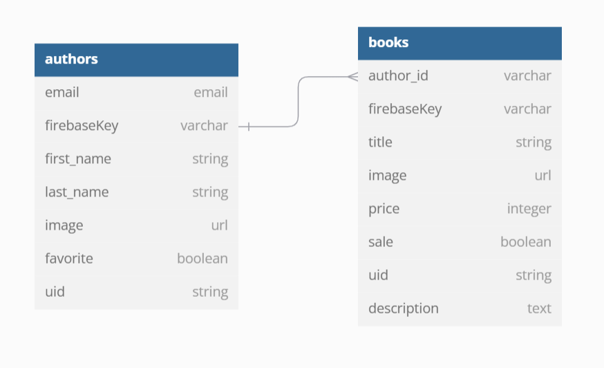

API Structure & Design	
	
	5
	Exceeds Expectations
	"- API is well-structured and follows RESTful principles.
- All routes and endpoints are logically organized, including CRUD operations for both books and authors.
- Efficient error handling for invalid requests and inputs."

Endpoints & Routing	
	
	5
	Exceeds Expectations
	"- Endpoints are clear, well-named, and consistent.
- Each endpoint performs its function (CRUD) correctly.
- Dynamic routing is handled efficiently for relationships (e.g., fetching books by author)."

Database Interaction	
	
	5
	Exceeds Expectations
	"- Efficient interaction with the Firebase database.
- Data is correctly stored and retrieved for both books and authors.
- All data operations are user-specific and secured.
- Clear separation between public and private book data (stretch goal)."

Many-to-Many Relationship	
	
	5
	Exceeds Expectations
	"- Many-to-many relationship is fully implemented (e.g., books with multiple genres or authors associated with multiple publishers).
- Relationships are properly stored in Firebase.
- API allows for easy querying of related data."

Error Handling & Validation	
	
	5
	Exceeds Expectations
	"- Excellent error handling across all API routes.
- Proper validation for input data, preventing bad data from being stored.
- Custom error messages are user-friendly and helpful."

Postman Documentation	
	
	5
	Exceeds Expectations
	"- Postman collection is fully deployed and documented.
- Includes detailed descriptions for each endpoint, request parameters, and expected responses.
- Example requests and responses are provided.
- Collection is easy to follow and use."

README & Additional Documentation	
	
	5
	Exceeds Expectations
	"- README is detailed and well-written.
- Includes clear instructions for setting up and using the API.
- Examples of how to authenticate and interact with the API are included.
- Documentation is thorough and professional."
BE Definition of Done
A feature or task is considered "done" when:

All tasks, features, and fixes must be ticketed and included on the GitHub project board. Make sure the project board uses columns like Backlog, In Progress, Testing, and Done to track work.
The code is fully implemented and meets the requirements defined in the task.
The feature passes all AC especially for CRUD functionality.
The user can successfully perform Create, Read, Update, and Delete operations for both books and authors using postman.
All relationships between authors and books are correctly established and maintained.
The API docs are deployed on Postman, and all features work in the deployed environment.
The README is updated with any relevant instructions, and a Loom video (max 5 minutes) demonstrates the app's features.
For any stretch goals, the feature must be functional and demonstrate proper user interaction (e.g., public/private book functionality, simulated purchase).
Any issues or bugs identified during development or testing must be fixed by the developer. All work related to fixes must be ticketed and included on the GitHub project board.
The project board must reflect all tasks, bugs, and updates, with each task being moved through the proper columns (Backlog, In Progress, Testing, Done).
MVP Guidelines
The Minimum Viable Product (MVP) for the Simply Books project includes:

CRUD Functionality for Books and Authors:

Users must be able to create, read, update, and delete books and authors.
When viewing an author, all books associated with that author must be visible.
When deleting an author, all of their books are also deleted.
Author-Book Relationship:

Each book must be associated with an author.
When a user views a book, the associated author's details must be accessible.
Firebase Integration:

The app must use Firebase for authentication and real-time data management.
Books and authors are tied to the logged-in user.
User-Specific Data:

Each user should only see their own books and authors.
Stretch Goals:
Public/Private Books:

Users can mark books as public or private.
Public books are viewable by all users without needing to log in.
Private books are only visible to the user who created them.
Simulated Book Purchases:

Users can add books to a cart and simulate purchasing them.
No real transaction will occur, but the UI will allow users to add items to the cart and check out.
Guide to Getting Started
Follow the deployment guide to get your app live!

Follow the Guide:

Detailed steps for each part of the project can be found in the Guide to getting started with this project.
Submit:

Make sure to complete the README, Loom video demonstration, and submit your project with the deployed link.

